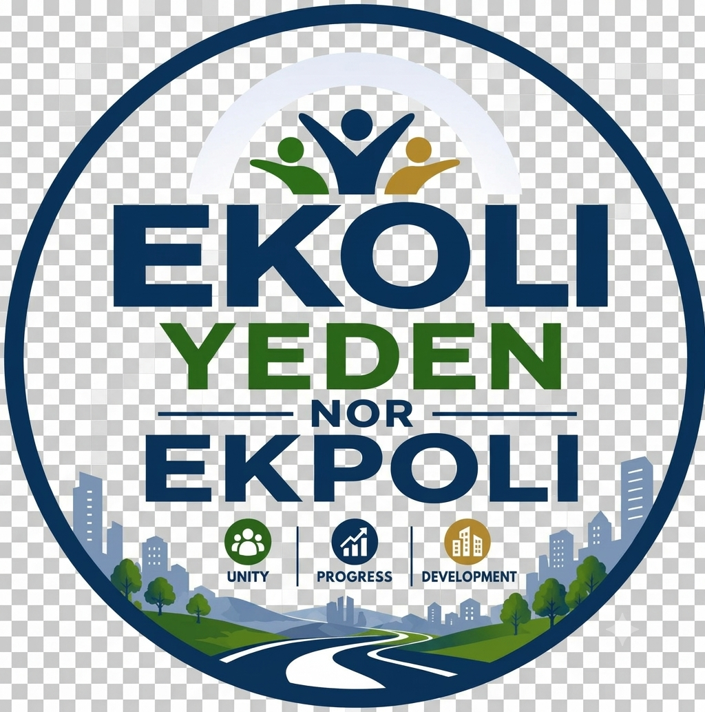

<div align="center">



# EKOLI YEDEN DIGITAL HOME

**Preserving Our Past. Celebrating Our Present. Building Our Future.**

A permanent digital home and heritage archive for Ekoli-Yeden.

[Live site](https://ekoli.pages.dev) · [API](https://ekoli-yeden-api.ndovera.workers.dev/api/health)

</div>

---

## What this is

Most of what a community knows about itself lives in places that were never
built to last — personal phones, WhatsApp groups, family albums, and the
memories of elders. A photograph is lost when a phone breaks. A message
disappears. Knowledge that is never recorded goes with the person who held it.

This is the alternative: one permanent, searchable, verified place for the
history, language, culture, people, leadership and festivals of Ekoli-Yeden.

### The rule the whole system is built around

**Nothing is invented.**

No history, chief, leader, date, cultural claim, statistic or meaning of an
Ekoli word appears on this site because software produced it. Where the
community has not supplied something, the page says so plainly rather than
filling the space with a plausible guess. Material drawn from outside sources
is labelled with its provenance and marked unverified until the Preservation
Team has checked it.

That principle is enforced in the schema, not just in the interface: content
defaults to `draft`, verification defaults to `unverified`, and only
`published` records are reachable by an anonymous visitor.

---

## Architecture

```
              Flutter Web  ──►  Cloudflare Pages          ekoli.pages.dev
                    │
                    │  HTTPS · JSON · bearer token
                    ▼
            Cloudflare Worker (TypeScript)      ekoli-yeden-api.ndovera.workers.dev
                    │
        ┌───────────┼───────────┐
        ▼           ▼           ▼
       D1          R2        YouTube
    records      files       videos
```

The Worker is the whole backend and the only component that holds a D1 binding,
an R2 binding or a secret. The Flutter bundle is downloaded by every visitor, so
anything inside it is public by definition — which is why it contains no
Cloudflare credential of any kind and talks to nothing but this one API.

| Layer | Technology |
|---|---|
| Frontend | Flutter Web |
| Hosting | Cloudflare Pages |
| API | Cloudflare Workers (TypeScript) |
| Database | Cloudflare D1 |
| File storage | Cloudflare R2 |
| Video | YouTube |

Videos are never stored in R2. YouTube hosts them; D1 holds the catalogue
record. That keeps storage costs proportional to photographs and audio, and it
means videos the community has already published can be organised here without
being re-uploaded.

---

## Repository layout

```
ekoli-yeden/
├── frontend/          Flutter Web application
│   ├── lib/
│   │   ├── core/          config, routing, theme, shared widgets, utils
│   │   ├── models/        typed views over the API's JSON
│   │   ├── services/      API client, auth, token storage
│   │   ├── repositories/  one per domain — the only callers of the API client
│   │   ├── features/      one directory per public section
│   │   └── admin/         Super Admin screens
│   └── assets/images/branding/   the supplied logo
│
├── worker/            Cloudflare Workers API
│   └── src/
│       ├── routes/        route tables — public, auth, contribute, editorial, admin
│       ├── controllers/   request handling
│       ├── services/      business rules, permissions, the content registry
│       ├── repositories/  D1 access
│       ├── middleware/    router, CORS, authorisation, rate limiting, errors
│       ├── types/         bindings and row shapes
│       └── utils/         crypto, validation, responses, R2 helpers
│
├── database/migrations/   D1 schema, applied in order
└── docs/                  architecture, database, contribution guidelines
```

### Two ideas worth knowing before reading the code

**The content registry** (`worker/src/services/content-registry.ts`) describes
every content type in one place: its table, its writable columns, its
searchable fields, and who may manage it. Routes, permissions, validation and
search are all generated from it. Adding a content type is a migration plus a
registry entry — not a new controller, repository and route file.

**The CMS** (`content_strings` table) holds the website's text. Every heading,
paragraph, button label, empty state and notice a visitor can read is a row in
the database, editable by the Editorial Team without touching code. Each call
site in Dart supplies a fallback, so the site renders correctly before the
database is seeded and survives the API being briefly unreachable.

---

## Roles

Nine platform roles, plus four editorial positions. The distinction that
matters: **the Editorial Team is not the Super Admin.**

| Role | May do |
|---|---|
| Super Admin | Everything, including users, roles, security and audit |
| Content Administrator | All content; no user or security administration |
| Heritage Editor | History, leadership, people, culture |
| Language Editor | The Ekoli dictionary and its recordings |
| Media Manager | Photographs, galleries, the video archive |
| Leboku Manager | Festival editions, programmes, festival events |
| Moderator | Reviews community contributions |
| Contributor | Submits material for review |
| Public Visitor | Reads published content |

Editorial positions split writing from publishing, so a volunteer can be
trusted to draft without being able to make anything live:

**Writer** → drafts and submits · **Editor** → edits pages, navigation, homepage,
SEO, sources · **Reviewer** → approves or rejects · **Publisher** → makes
approved content live.

None of the editorial roles holds `users.manage`, `roles.manage`,
`security.manage`, `settings.manage`, `audit.view` or `content.delete`. Those
permissions are simply absent from their arrays, and the Worker denies by
default — a permission that is not granted does not exist.

---

## The editorial workflow

```
draft ──► pending_review ──► approved ──► published
             │                              │
             └──► rejected ──► (revise)      └──► archived
```

Only `published` is visible to a visitor. Each transition needs its own
permission — submitting, approving and publishing are three different
authorities — and each writes a version snapshot and an audit entry.

**Version history.** Every editorial change snapshots the record before it is
applied, into `content_versions`. Versions are never deleted. If somebody
rewrites a paragraph of the history page, the previous wording remains
recoverable. An archive that can be silently rewritten is not an archive.

**Contributor attribution.** Who supplied a photograph is stored in
`content_contributors`, keyed to the record — not in the article. Nothing in
the editorial flow writes to that table, which is exactly why an
acknowledgement survives every later edit to the article it belongs to.

**Sources.** Citations live in `sources` and attach to any record through
`content_sources`. A history page shows where each claim came from, and flags a
source the archive considers contested.

---

## Local development

Requires Flutter 3.38+, Node 20+ and a Cloudflare account.

```bash
# 1. API
cd worker
npm install
cp .dev.vars.example .dev.vars          # then set JWT_SECRET to 32+ random chars
npx wrangler d1 migrations apply ekoli-yeden-db --local
npm run dev                             # http://localhost:8787

# 2. Website  (in a second terminal)
cd frontend
flutter pub get
flutter run -d chrome --dart-define=API_BASE_URL=http://localhost:8787
```

Check the API is healthy:

```bash
curl http://localhost:8787/api/health
# {"success":true,"service":"Ekoli Yeden Digital Home API","status":"healthy"}

curl http://localhost:8787/api/health/ready   # also checks D1, R2 and the secret
```

### Before committing

```bash
cd frontend && flutter analyze && flutter test
cd ../worker && npx tsc --noEmit
```

---

## Deployment

```bash
# API
cd worker
npx wrangler d1 migrations apply ekoli-yeden-db --remote --env production
npx wrangler secret put JWT_SECRET --env production
npx wrangler deploy --env production

# Website
cd frontend
flutter build web --release \
  --dart-define=API_BASE_URL=https://ekoli-yeden-api.ndovera.workers.dev \
  --dart-define=ENVIRONMENT=production \
  --dart-define=SITE_URL=https://ekoli.pages.dev
npx wrangler pages deploy build/web --project-name ekoli --branch main
```

`frontend/web/_redirects` provides the SPA fallback that makes clean URLs work
on Pages — without it, `/history` would 404 because that path exists only
inside the Flutter router.

### Environment variables

Set with `--dart-define` at build time. All are public; none is a secret.

| Variable | Purpose |
|---|---|
| `API_BASE_URL` | Where the Worker lives |
| `ENVIRONMENT` | `development`, `staging` or `production` |
| `SITE_URL` | Canonical origin, used to build SEO URLs |

### Secrets

Held only by the Worker, set with `wrangler secret put`, never in source and
never sent to the client.

| Secret | Purpose |
|---|---|
| `JWT_SECRET` | Signs session tokens. 32+ characters, required |
| `YOUTUBE_API_KEY` | Optional. Pre-fills video metadata for an administrator |

---

## Security

- **Zero trust.** Every protected request is authenticated, resolved to a user,
  checked for role and granular permission, and denied by default. The decision
  is made in `worker/src/services/permissions.ts` and never delegated to the
  client. Hiding a button in Flutter is a courtesy; the API is what refuses.
- **Passwords** are PBKDF2-HMAC-SHA256 with a per-user salt, at the Workers
  runtime's maximum of 100,000 iterations.
- **Sessions** store only a digest of the refresh token, so a database snapshot
  cannot be replayed. Refresh rotates the session; a stolen token is usable at
  most once. Suspending an account or changing a password revokes every session
  immediately.
- **CORS** is an explicit allow-list per environment. There is no `*` fallback.
- **Errors** never expose a stack trace, an SQL fragment, a binding name or a
  secret. A request id ties the message a visitor sees to the log line that
  explains it.
- **Uploads** are checked against a per-folder MIME allow-list and size limit,
  and re-checked after reading rather than trusting client-reported metadata.
- **IP addresses** are stored only as a salted digest in the audit log.
- **The audit log** is append-only. There is no update or delete path in the
  application.

---

## Documentation

| Document | Contents |
|---|---|
| [docs/architecture.md](docs/architecture.md) | How the layers fit together, and why |
| [docs/database.md](docs/database.md) | Every table and the reasoning behind it |
| [docs/contribution-guidelines.md](docs/contribution-guidelines.md) | For developers, and for the Preservation Team |

---

## Status

Modules 1 and 2 are complete and deployed. The platform is finished and the
archive is empty — which is the correct state for a community archive on its
first day. Every section is ready to receive verified material.

The one exception is the history section, which carries an **Initial Research
Edition**: a compilation from two secondary web sources, every claim attributed
inline, flagged unverified, and published under a notice saying it is a
starting point for research rather than settled community history. One of those
sources carries Wikipedia's own banner stating it cites no sources at all, which
is recorded in the citation.

The first real work is not more code. It is constituting the Preservation Team,
creating their accounts, and beginning to collect what the elders still
remember.

---

<div align="center">

**Unity · Progress · Development**

</div>
